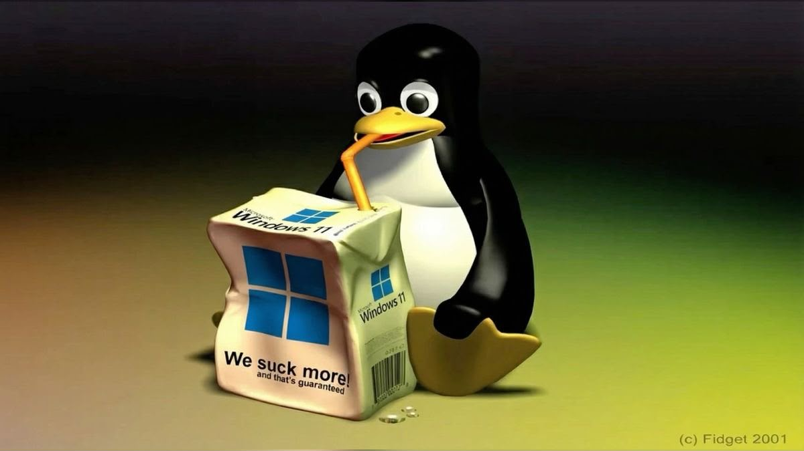
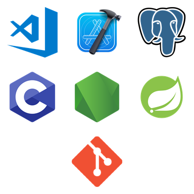

  

<h1>Hello, world!</h1>

Desenvolvedor back-end com experiência em desenvolvimento de sistemas e aplicações web. Tenho grande interesse por inovação e busco constantemente novos desafios que me permitam aplicar minhas habilidades técnicas, além de expandir meus conhecimentos. Atualmente, estou cursando o sexto período em Engenharia da Computação na <b>FAM</b>, em São Paulo - SP, Brasil.

 

<h2>Experiência Profissional</h2>

Atualmente atuo como estagiário em desenvolvimento full stack na <a href="https://github.com/lwnteamanalise">LWN Team Análise</a>, onde participo ativamente do desenvolvimento e manutenção de aplicações web. Entre as principais atividades desempenhadas, destaca-se o desenvolvimento de APIs e integrações utilizando Node.js, estruturação e gerenciamento de bancos de dados relacionais com PostgreSQL, criação de interfaces e lógica de front-end com JavaScript, HTML e CSS, além de deploy e hospedagem de aplicações em plataformas como Vercel e Neon. Utilizo Git e GitHub para controle de versão e colaboração em equipe, participando de levantamento de requisitos e planejamento de sprints.

 

<h2>Habilidades Técnicas</h2>

Possuo experiência sólida em Java e Spring Boot para desenvolvimento de aplicações robustas e escaláveis, Swift para desenvolvimento no ecossistema Apple, MySQL e PostgreSQL para modelagem e gerenciamento de bancos de dados relacionais, Node.js para construção de back-end eficiente e de alta performance, e C para fundamentos de programação e sistemas de baixo nível. Além disso, tenho conhecimento em Git e GitHub para versionamento de código e trabalho colaborativo. Busco constantemente aprimorar meus conhecimentos, mantendo código limpo e aplicando boas práticas de desenvolvimento. No ambiente acadêmico, foco em expandir minha base teórica e prática por meio de projetos, desafios e cursos complementares.

  
  

