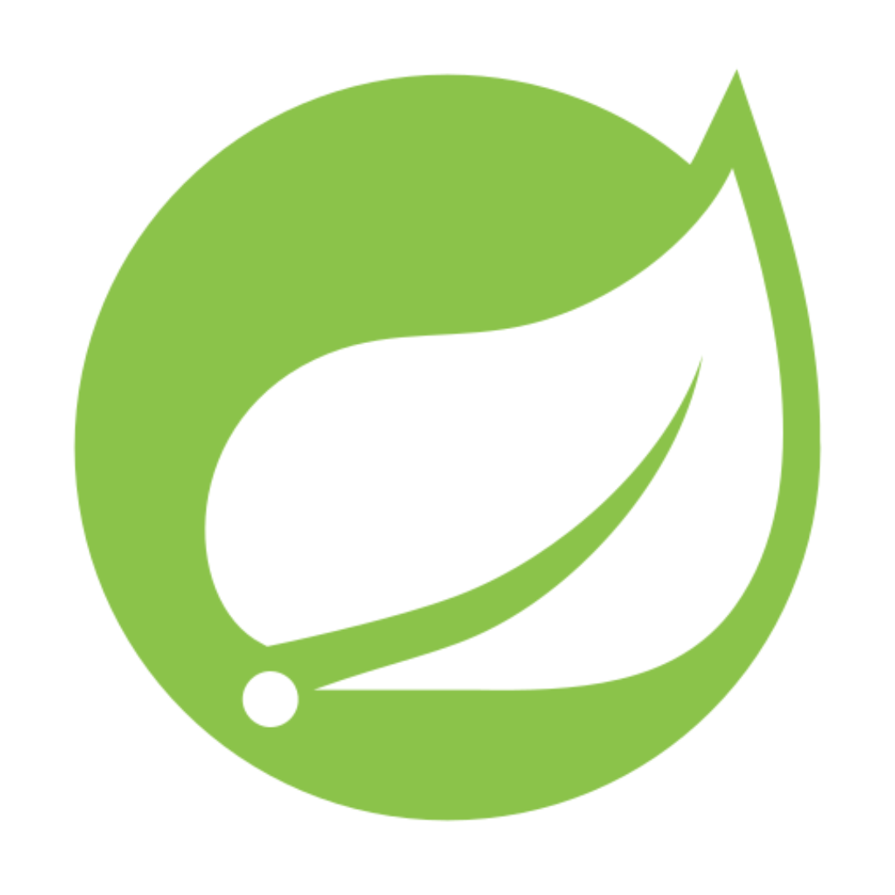

<b>Hello, world!</b>

  

     
# Sobre mim

<!-- Software and mobile developer with experience in various areas of systems development. I have a strong interest in innovation and am always seeking new challenges that allow me to apply my technical skills and expand my knowledge. I am currently pursuing a degree  in Computer Engineering at the Centro Universitário de Votuporanga (Unifev), in Votuporanga - SP, Brazil. With a solid academic foundation and a proactive approach, I am open to new opportunities in the technology sector, aiming to contribute to the advancement of  impactful technological solutions. 
-->
Desenvolvedor de software e mobile, com experiência em diversas áreas em Desenvolvimento de Sistemas. Tenho grande interesse por inovação e busco constantemente novos desafios que permitam aplicar minhas habilidades técnicas, além de expandir meus conhecimentos.
Atualmente, estou cursando o terceiro período de Engenharia da Computação no Centro Universitário de Votuporanga (Unifev), em Votuporanga – SP, Brasil.

# Experiência
<!--
I have experience and skills as a programmer, with an emphasis on `Java & Frameworks`, `Swift`, `Flutter`, `Python`, `C`, `MySQL`, `PostgreSQL`, `Node.js`, `Web development`, and `APIs`. I am constantly seeking to improve my knowledge and skills, highlighting my ability to solve problems, think critically, work in a team, and communicate effectively.
<!--
In the academic environment, I focus on improving my expertise in various programming languages, fundamental computing concepts, and software development through projects and challenges. Additionally, I strive to expand my knowledge continuously through courses and individual projects.
<!--
I am looking for new opportunities in the job market in the fields of Software Development, Mobile, and Back-end, with the goal of contributing to the advancement of innovative and impactful technological solutions.   
-->

         

          

          

          

           

           
 

 
Possuo experiência e habilidades como programador em `Java & Frameworks`, `Swift`, `Flutter Basic`, `Python`, `C`, `MySQL`, `PostgreSQL`, `Node.js`, `Desenvolvimento Web` e `APIs`. Busco constantemente aprimorar meus conhecimentos e habilidades, destacando minha capacidade de resolver problemas, pensar de forma crítica, trabalhar em equipe e ter boa comunicação.

No ambiente acadêmico, foco em aprimorar meus conhecimentos em diversas linguagens, manter código limpo (clean code), conceitos fundamentais de computação e desenvolvimento de software por meio de projetos e desafios. Procuro expandir meus conhecimentos por meio de cursos e projetos individuais.
  

  

 
  &nbsp;
    &nbsp;
  

  

<!-- 

<!-- 

<!--
<!-- # Skills
<!--
<!-- ### Languages
<!-- 

<!--     
<!--     
<!--     
<!--     
<!--     
<!--     
<!--     
<!--     
<!--     
<!--    

<!--
<!-- ### Frameworks & Database
<!-- 

<!--     
<!--     
<!--     
<!--     
<!--     
<!--     

<!-- 
<!-- ### Tools
<!--
<!--  

<!--    
<!--    
<!--    
<!--     
<!-- 

<!-- 

<!-- #
<!-- 
